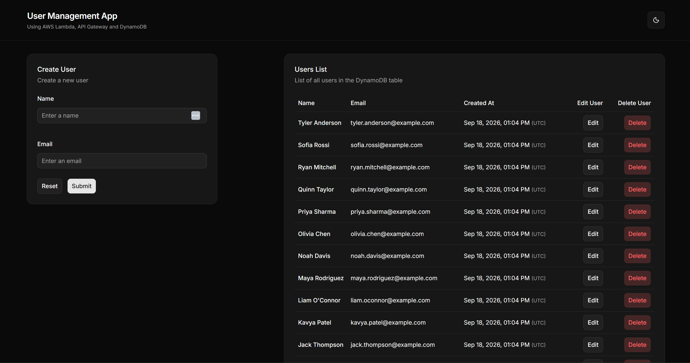
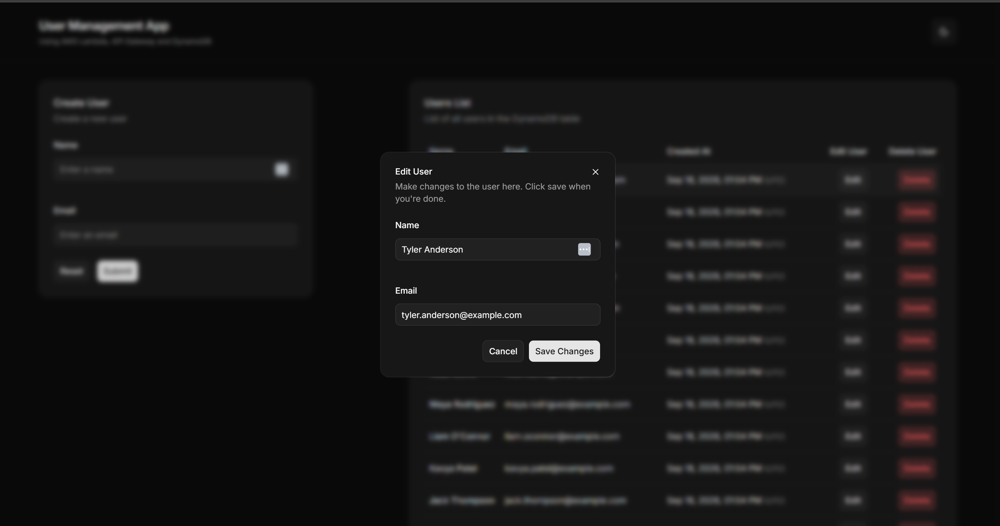
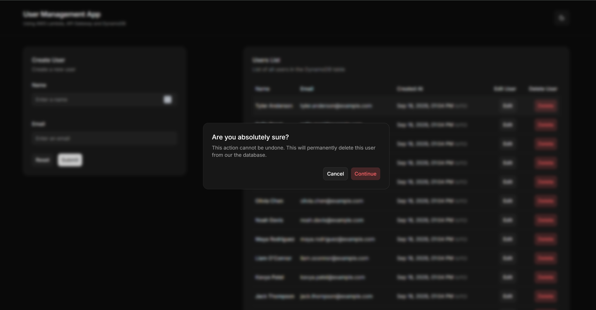

# User Management App
**Live site:** https://hk-usermanagement.vercel.app/

Manage users through a simple UI. Create, edit and delete users, with a backend using AWS Lambda, API Gateway and DynamoDB.

## Screenshots

**Main page:** create a new user and browse the full list, sorted newest first.

**Edit user:** update a user's name and email from a pre-filled dialog.

**Delete user:** confirm before removing a user from the table.

## Built with

**Frontend**
- [Next.js](https://nextjs.org/)
- [TypeScript](https://www.typescriptlang.org/)
- [TanStack Query](https://tanstack.com/query): data fetching, caching and server-side prefetching
- [Axios](https://axios-http.com/): API client
- [React Hook Form](https://react-hook-form.com/): form state management
- [Zod](https://zod.dev/): schema validation
- [Tailwind CSS](https://tailwindcss.com/): styling
- [shadcn/ui](https://ui.shadcn.com/): UI components
- [next-themes](https://github.com/pacocoursey/next-themes): light/dark mode

**Backend**
- [AWS CDK](https://aws.amazon.com/cdk/): infrastructure as code
- [AWS Lambda](https://aws.amazon.com/lambda/): backend functions
- [Amazon API Gateway](https://aws.amazon.com/api-gateway/): HTTP routing
- [Amazon DynamoDB](https://aws.amazon.com/dynamodb/): database
- [AWS SDK for JavaScript v3](https://github.com/aws/aws-sdk-js-v3): DynamoDB client